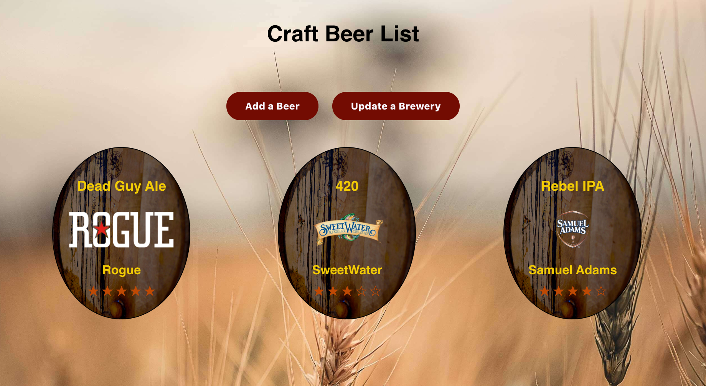
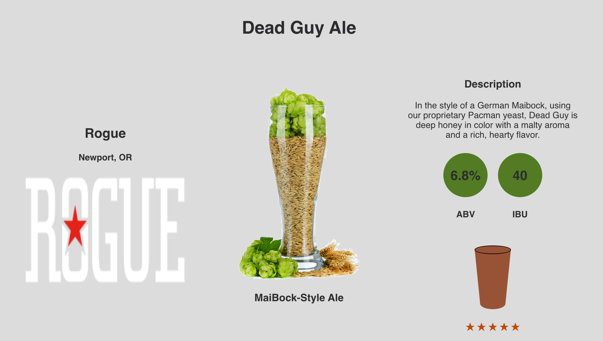
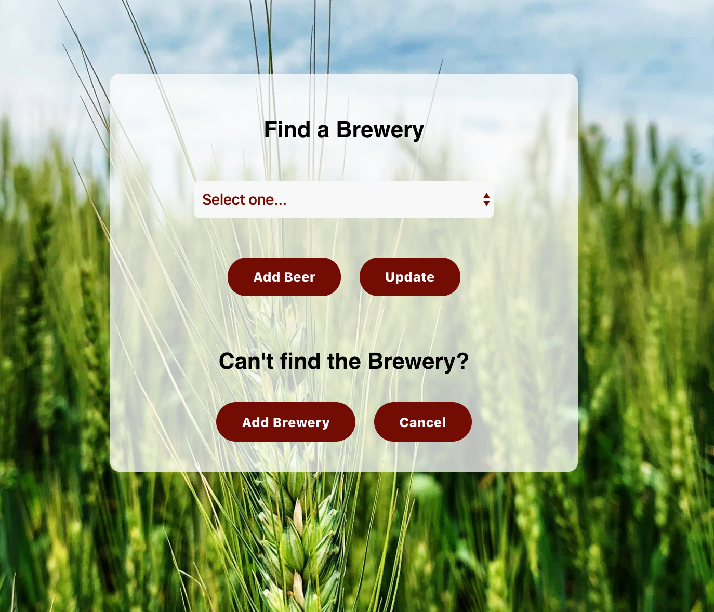

# Craft Brew Locker

## Summary
A web application to catalog our favorite craft beers and their associated breweries.  Users can add breweries, beers to those breweries and then post comments on the beers.  Both beers and breweries can be updated if needed.

## Technology Used:
  - JavaScript
  - React.JS
  - Node.JS w/ Express
  - PostgreSQL
  - CSS3
  - Deployed on Zeit / Heroku

See the Live Site: https://cbl-app.now.sh/

Jump to the Server Repo: https://github.com/mblakley4/cbl-api

### Homepage Screenshot

### Beer Data

### Find, Update, or Add a Brewery PledgeForm

